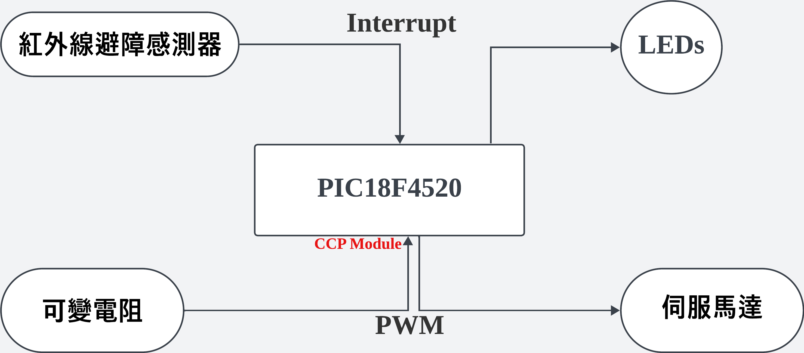
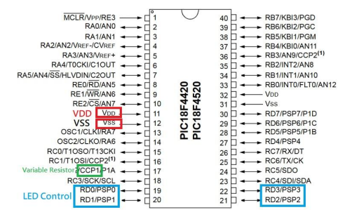
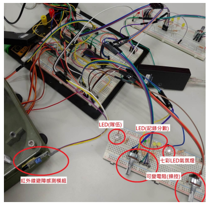
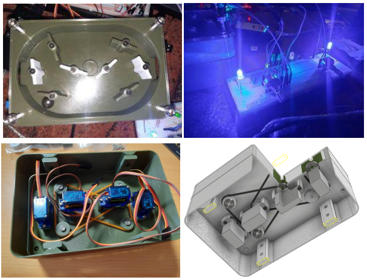

# MCU final project

## Introduction
### a. 系統功能與原理說明
本次設計為改良版手足球檯，紅藍兩隊各以兩個可變電阻控制葉片旋轉用以擊球，另外
以紅外線避障感測偵測球是否進門，以LED紀錄分數。
### b. 系統使用環境及對象
使用MPLAB IDE v5.20進行程式的編寫及燒錄
使用PIC18F4520 * 4個
### c. 架構圖
- 系統架構圖

- PIC18及連接埠使用

- 系統電路圖

- Design

